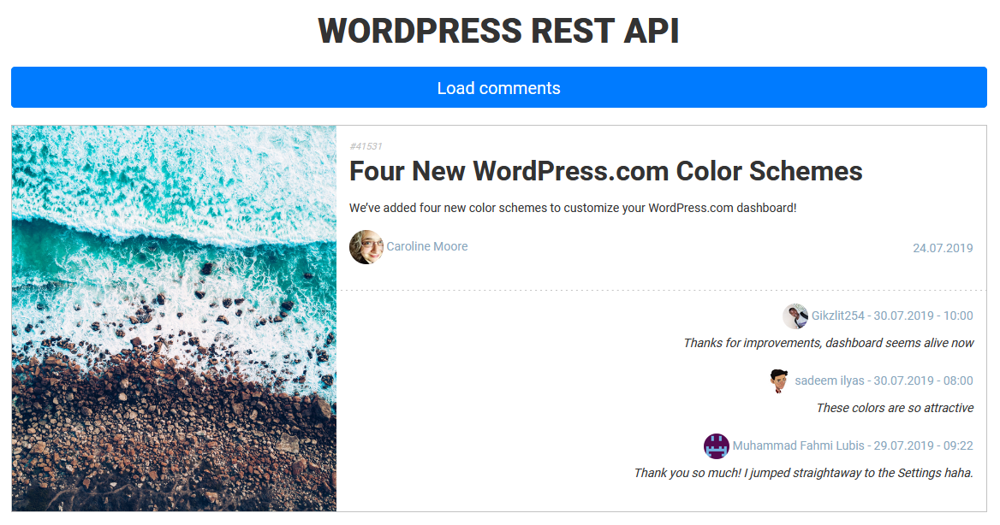

<p align="center">
    
</p>

## Table of contents
* [General info](#general-info)
* [Code organization](#code-organization)
* [Acknowledgements](#acknowledgements)
* [Setup](#setup)

## General info
This Angular project is use of [WordPress REST API](https://developer.wordpress.com/docs/api/) to get posts and comments sequentially after button click.

## Code organization
    .
    ├── comment                                 # Component resposible for representing one comment
    ├── comments-list                           # Component resposible for representing comments list
    ├── post                                    # Component resposible for representing one post
    ├── posts-list                              # Component resposible for representing posts list
    └── services
        ├── app.service.ts                      # Main application service
        └── storage.service.ts                  # Service responsible for session storage usage

## Acknowledgements
* [Google Fonts](https://fonts.google.com)
* [Bootstrap v4.3.1](https://getbootstrap.com)
    
## Setup
To run project:
```
npm i
npm start
```
